# Efface-the-haze

The main aim of this project is to apply CV techniques and develop pipeline for image enhancement via Dehazing. This project is carried out as part of Computer Vision course CSL7360.

## Experimental Setup

Images are ***resized to 128x128*** for the below experiments

- [Dark channel prior](http://kaiminghe.com/publications/cvpr09.pdf) (DCP) for single image haze removal was implemented. Along with this the preprocessing technique such as White Balance (WB) and postprocessing techniques CLAHE(Contrast Limited Adaptive Histogram Equalization) and DWT(Discrete wavelet Transform) were also implemented.
- Inference on **RESIDE** test dataset (**SOTS Indoor & SOTS Outdoor**) was carried out on [FFA-Net pretrained model](https://drive.google.com/drive/folders/19_lSUPrpLDZl9AyewhHBsHidZEpTMIV5?usp=sharing).
- Involuted U-Net architecture with custom loss is created and trained on **RESIDE** dataset. Evaluation is carried out using RESIDE test dataset (**SOTS Indoor & SOTS Outdoor**).

Custom loss is defined as below :

**Composite loss = 0.6 * Perpetual Loss (AlexNet) + 0.1 * SSIM Loss + 0.3 * PSNR Loss**

## Datasets and Architectures

| Dataset | Architecture     | Description                       |
| :-------- | :------- | :-------------------------------- |
| **[RESIDE](https://www.kaggle.com/balraj98/indoor-training-set-its-residestandard)**| [FFA-Net](https://github.com/zhilin007/FFA-Net) | **[FFA-Net: Feature Fusion Attention Network for Single Image Dehazing (AAAI 2020)](https://arxiv.org/abs/1911.07559)** |
| **[RESIDE](https://www.kaggle.com/balraj98/indoor-training-set-its-residestandard)**| Involuted U-Net | **U-Net architecture augmented with [Involution](https://arxiv.org/abs/2103.06255)** |

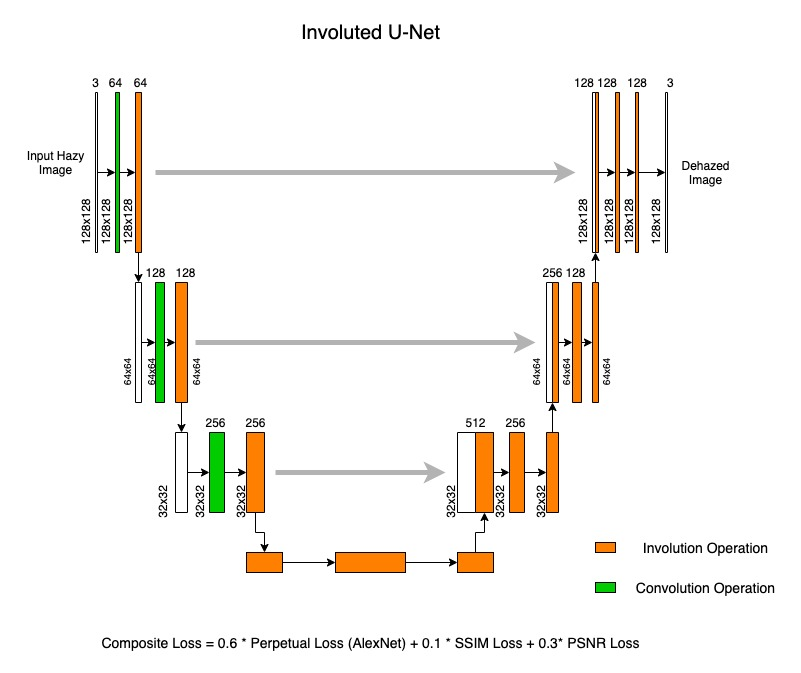

[**FFA-Net: Feature Fusion Attention Network**](https://arxiv.org/abs/1911.07559)

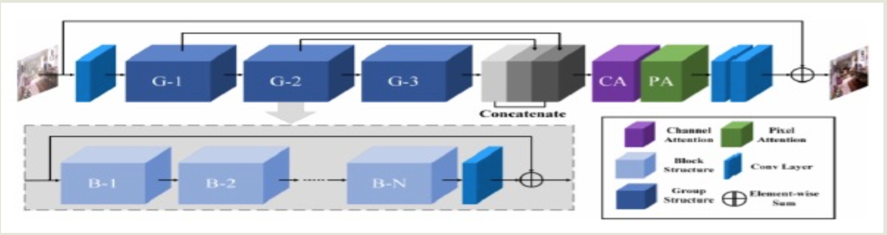

## Training

Training is carried out Training is carried out for 15 epochs with SGD optimizer, using learning rate 1e-2, weight decay of 0.01 and momentum 0.9 on Involuted U-Net

## Results (128x128 Size)

| Methods | Indoor     | Indoor                       | Outdoor | Outdoor |
| :-------- | :------- | :-------------------------------- |:-------|:-----|
| | PSNR |  SSIM  | PSNR     |    SSIM              |
| DCP | 14.77 |  0.7757  | 22.65     |    0.9226              |
| DCP with Preprocessing and Postprocessing(Pipeline1)| 11.83 |  0.678  | 15.7     |    0.7712              |
| DCP with Preprocessing and Postprocessing(Pipeline2)| 11.15 |  0.5116  | 14.93     |    0.6395              |
| FFA-Net on pretrained model| 14.86 |  0.5559  | 19.41 |    0.6363       |
| Ours (Involuted U-Net)| **16.85** |  **0.6073**  | **17.78** |    **0.5790**        |

- *Pipeline1 - DCP + Preprocessing with WB + Postprocessing with CLAHE*
- *Pipeline2 - DCP + Preprocessing with WB + Postprocessing with CLAHE & DWT*

## **Indoor Results**

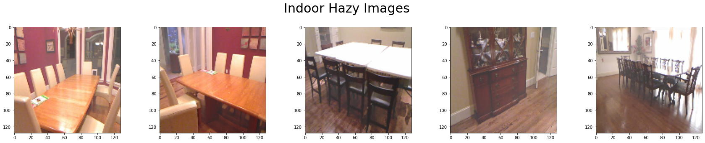

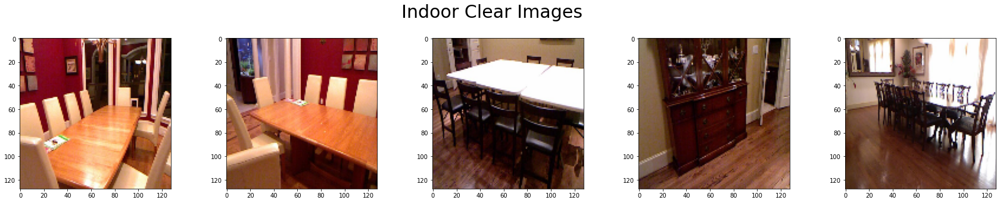

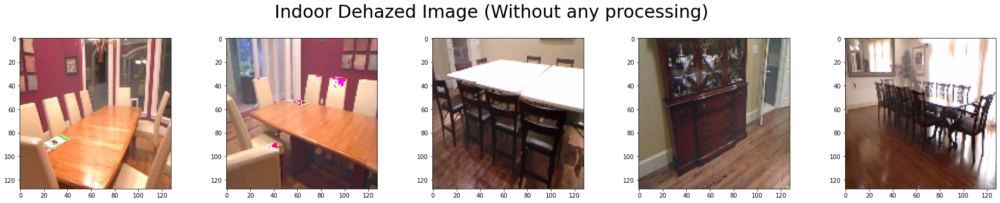

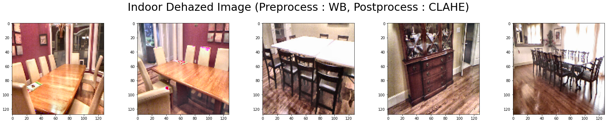

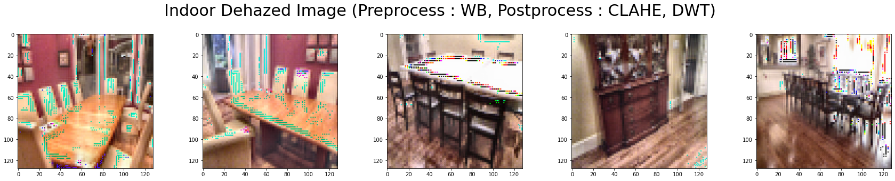

***FFA-Net :***

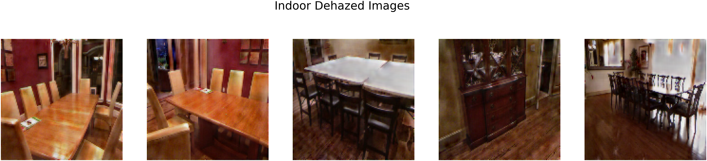

***Ours (Involuted U-Net) :***

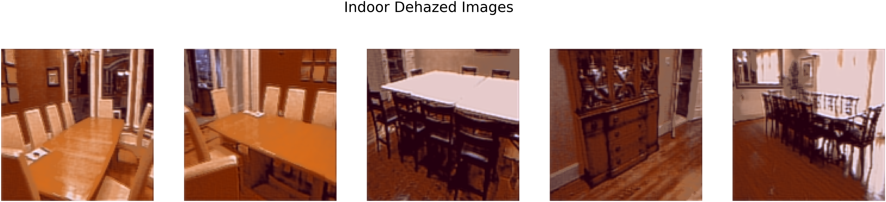

## **Outdoor Results**

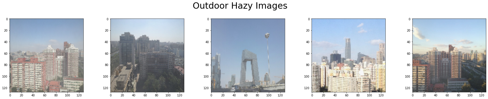

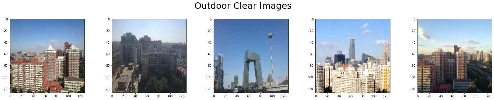

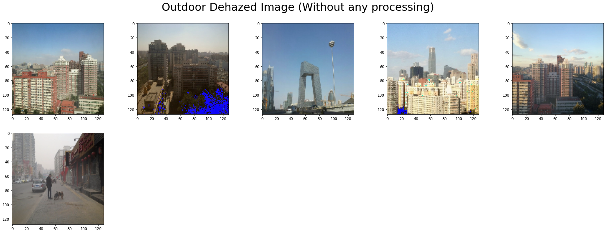

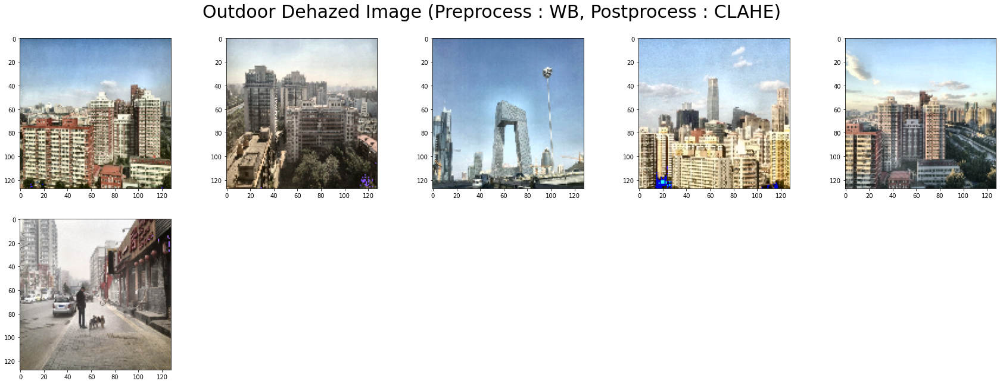

***FFA-Net :***

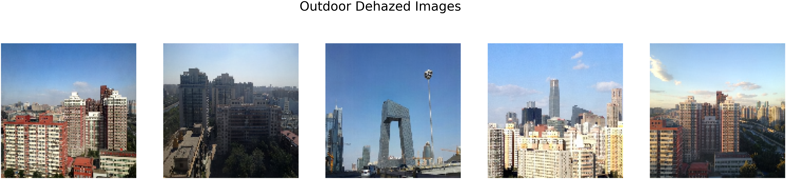

***Ours (Involuted U-Net) :***

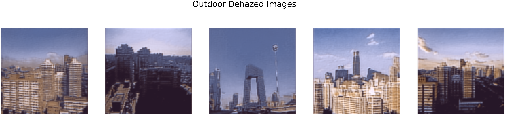

## Test

Trained_models for involuted U-Net are available at google drive : https://drive.google.com/drive/folders/18KWAMBP9gNB0PAGrVRNPmB8rxw5nRtuW?usp=sharing

## Demo

## Authors

- [@ksasi](https://github.com/ksasi)
- [@NikhilaDhulipalla](https://github.com/NikhilaDhulipalla)
- [@Adhun](https://github.com/adhun36)

## Acknowledgements

 - [Involution](https://github.com/ChristophReich1996/Involution)
 - [Perpetual Similarity](https://github.com/richzhang/PerceptualSimilarity)
 - [Kornia](https://kornia.readthedocs.io/en/latest/losses.html)
 - [gradio](https://www.gradio.app/)
 - [U-Net](https://amaarora.github.io/2020/09/13/unet.html)
 - [Albumentations](https://medium.com/pytorch/multi-target-in-albumentations-16a777e9006e)
 - [Pytorch](https://pytorch.org/)
 - [OpenCV](https://docs.opencv.org/3.4/)
 - [FFA-Net](https://github.com/zhilin007/FFA-Net/blob/master/net/metrics.py)

